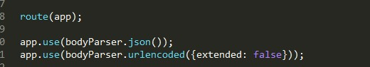

- 遇到一个问题：前端接口可以去到后台返回的所有东西，但是状态上是304

看了半天说这不是bug,说明缓存过不需要再传了;

- axios post请求参数格式

因为刚开始的时候，设置了`application/x-www-form-urlencoded`格式发送数据,数据必须是`URLSearchParams`类型，或者字符串参数`a=1&b=2`格式

可以引入`qs`模块格式化一下,后来试了一下，可以的

```
var qs = require('qs');
axios.post('/foo', qs.stringify({ 'bar': 123 }));
```
- 格式对了，但是后台并不能取到前台发的参数

我到处找，到处看，最后**`app.use(bodyParser.json());` 一定要写在路由前面！** 


